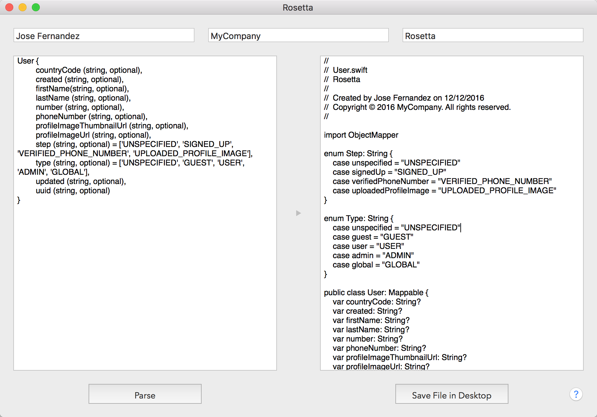

# Rosetta

Rosetta is a Mac app created on my own to save time by automatically parsing the class models we need from Swagger.io.

## Why?
In our company we use to work with Swagger.io. I was always finding myself over and over again by tediuosly copying and pasting the models from the online documentation just to generate our own model classes in Swift. It was a really heavy task and we were losing tons of time just by doing the same task. So I thought that could be made in an automatic way, therefore I decided to create this MacOS app which generates the classes we need on its own.

## How it works
Basically you only need to paste the model class from Swagger.io in the left text view and it will automatically create the Swift model class for you in the right one. Then you can review the generated code and correct it in case you spot any error. Finally there's a button which saves your class file in the desktop.
Keep in mind that I have adapted the resulting code specifically to our company and way of work, so we have 100% fully ready and integrated classes for our projects to save time. Ah!, it also maps the enum values and creates the enumerations for you. Now I have added a preferences panel where you can set some desired parsing options, like the number of spaces for indentation, toggle the proprietary comments or specify the desired parsing tool.

## Release Notes

0.2.1
- Update UI by removing all occurrences of the old app name.
- Clean code and refactoring.

0.2
- Changed name of the app and icon with inspiration from Rosetta Stone.
- Added preferences screen where you can set the number of spaces for indentation, toggle the header comments and the mapping service (currently working with manual mapping and objectmapper).
- Slightly refactoring and cleaning code.
- Added support for manual mapping.

## Upcoming versions

0.2.2
- Added NSAlert to show possible errors when parsing.
- Cleaned resulting code for manual mapping.
- Clean code and refactoring.

0.2.3
- Test for missing features and known/possible bugs by testing against 'http://petstore.swagger.io'
- Handling mapping of dictionaries inside the main model, e.g. 'prices' dictionary (currency, amount, divisor) inside 'clothes' model.

0.3
- Clean code and refactoring.
- Unit Testing.
- Error handling and show errors visually to the user.

0.4
- Clean code and refactoring.
- Unit Testing.
- Possibility to create the mapping classes as structs.
- Onboarding/tutorial/help.

0.5
- Clean code and refactoring.
- Unit Testing.
- Add support for SwiftyJSON.

🔜 Some day in the future (I might include some of these for future versions depending on my availability)
- Change the behaviour so you only need to setup the url of the API docs, the client id and client secret and it will automatically detect and parse all the class models and generate all the class files for you. I have been researching about Swagger tools and it seems  that 'Swagger Codegen' could help with that, but I need some time for that.
- Allow to set the project path so the files are automatically created there.
- Improve massively the quality of the code. I made the app as a quick solution in a couple of days so needs lots of refactoring and improvements.
- Adapt it to other API docs services and frameworks (JSONDoc, Mashery, RestKit, etc).

💭 Please feel free to write any comments, pull requests, forks, etc!
